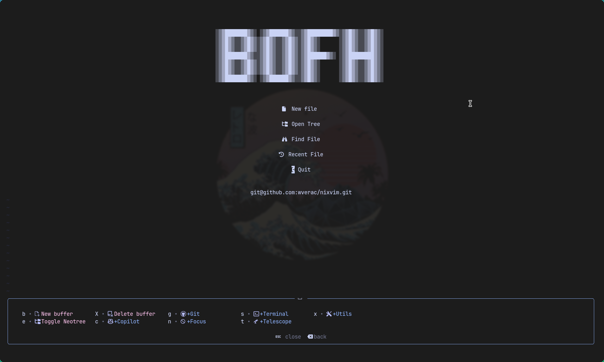
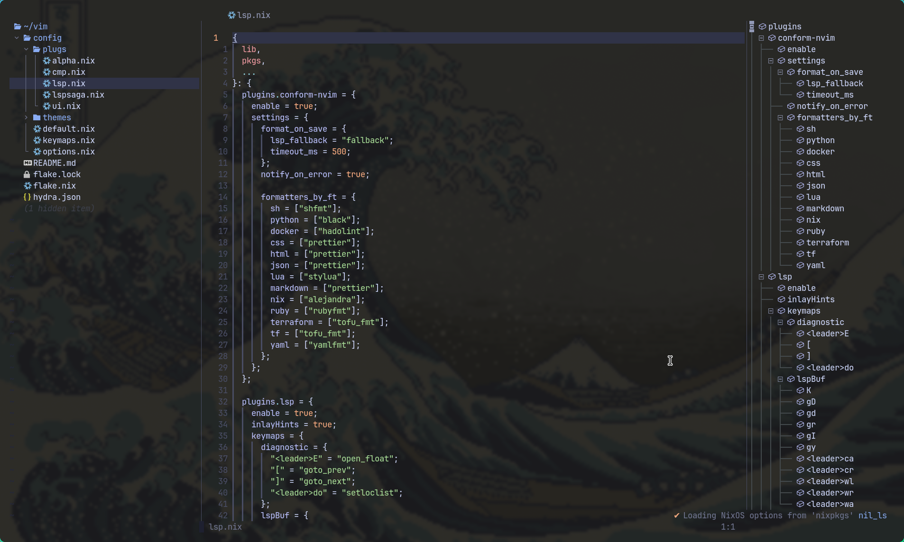

<h1 id="header" align="center">
    
   <br>
 sysBOFH NixVim
</h1>

#### This is my functional, minimalist, and carefully curated collection of essential plugins, paired with a clean and simple configuration for [NixVim](https://nix-community.github.io/nixvim/).

---




### Installation

#### Run it
```nix
nix run github:wverac/nixvim
```

#### Clone
```nix
git clone https://github.com/wverac/nixvim
nix run .
```

#### Flake

```nix
{
    inputs = {
        nixvim.url = "github:wverac/nixvim"
    };
}
```

#### System-Wide

```nix
environment.systemPackages = [
    inputs.nixvim.packages.x86_64-linux.default
];
```

#### Home-Manager

```nix
home-manager.users.<user>.home.packages = [
    inputs.nixvim.packages.x86_64-linux.default
];
```
#### My favorite method in non-NixOS systems
Requires [Nix package manager](https://nixos.org/download/#download-nix
)

```nix
alias vim='nix run github:wverac/nixvim'
```

### Structure

```bash
nixvim
├── config
│   ├── default.nix
│   ├── keymaps.nix
│   ├── options.nix
│   ├── plugs
│   │   ├── alpha.nix
│   │   ├── cmp.nix
│   │   ├── lsp.nix
│   │   ├── lspsaga.nix
│   │   └── ui.nix
│   └── themes
│       ├── catppuccin.nix
│       └── tokyonight.nix
├── flake.lock
├── flake.nix
├── hydra.json
└── README.md
```
### TODO

* Write a decent and useful TODO
